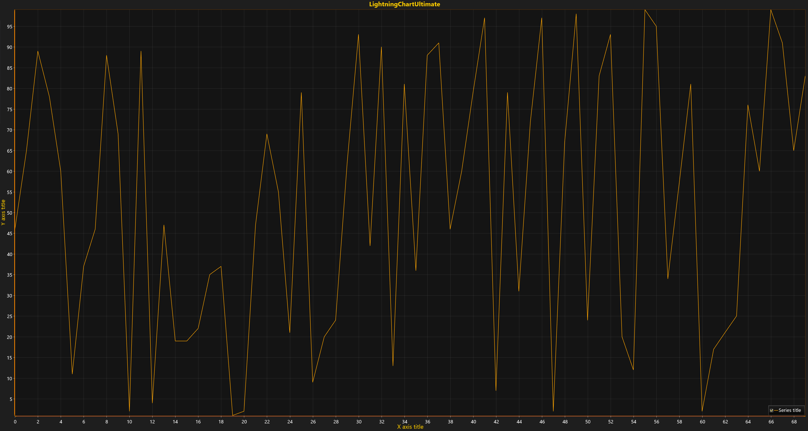

# Simple 2D Chart

With LightningCharts DLLs included in your project, you are ready to create your first chart. We will begin with creating a simple line chart for WinForms and WPF platforms without MVVM implementation.



The chart can be added to a designer e.g. \(Form, Window, Grid, Panel, etc.\) and configured by using Properties window. However, this tutorials series shows how to create everything in code, thereby providing the best way for maintainability in further project development.

##### 1. Declare a LightningChart instance.

   ```csharp
   // Create chart instance.
   var chart = new LightningChartUltimate();
   ```

##### 2. Set the parent container of the chart where it will be rendered.

   Windows Forms:

   ```csharp
   // Set parent container of chart.
   chart.Parent = this; 
   chart.Dock = DockStyle.Fill;
   ```

   WPF:

   ```csharp
   // Set the parent container of chart.
   (Content as Grid).Children.Add(chart);
   ```

##### 3. Create linear series, e.g. PointLineSeries.

   ```csharp
   // New line-series instance is assigned to default X and Y axes.
   var series = new PointLineSeries(
       chart.ViewXY,
       chart.ViewXY.XAxes[0],
       chart.ViewXY.YAxes[0]
   );
   ```

##### 4. Generate some random data or convert from source to appropriate format.

   ```csharp
   // Scatter data randomly.
   Random rand = new Random(); 
   int pointsCount = 70; 

   // Generate some data with your algorithm.
   var data = new SeriesPoint[pointsCount]; 
   for (int i = 0; i < pointsCount; i++) {  
        data[i].X = (double)i;         // “Your double X-value”; 
        data[i].Y = rand.Next(0, 100); // “Your double Y-value”; 
   }
   ```

##### 5. Set generated data-points into series.

   ```csharp
   series.Points = data; // Assign data.
   ```

##### 6. Add created linear series to chart collection of specific series type.

   ```csharp
   // Add the series into list of point-line-series.
   chart.ViewXY.PointLineSeries.Add(series);
   ```

##### 7. Autoscale chart axes to show all series data-points.

   ```csharp
   // Autoscale view according to given data. 
   chart.ViewXY.ZoomToFit();
   ```

##### 8. Build and Run the application.
