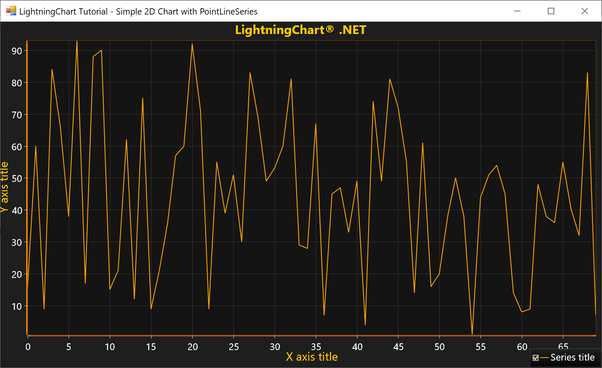

# Simple 2D Chart with PointLineSeries

With LightningCharts DLLs included in your project, you are ready to create your first chart. We will begin with creating a simple line chart for WinForms and WPF platforms without MVVM implementation.



The chart can be added to a designer e.g. \(Form, Window, Grid, Panel, etc.\) and configured by using Properties window. However, this tutorial series shows how to create everything in code, thereby providing the best way for maintainability in further project development.

##### 1. Create chart.

```csharp
// Create chart.
var chart = new LightningChartUltimate();
```

##### 2. Set the parent container of the chart where it will be rendered.

WinForms:

```csharp
// Set chart control into the parent container.
chart.Parent = this; 
chart.Dock = DockStyle.Fill;
```

WPF:

```csharp
// Set chart control into the parent container.
(Content as Grid).Children.Add(chart);
```

##### 3. Generate data for series.

```csharp
// Generate data for series.
var rand = new Random();
int pointCounter = 70;

var data = new SeriesPoint[pointCounter];
for (int i = 0; i < pointCounter; i++) 
{
      data[i].X = (double)i;
      data[i].Y = rand.Next(0, 100);
}
```

##### 4. Define variables for X- and Y-axis.

```csharp
// Define variables for X- and Y-axis.
var axisX = chart.ViewXY.XAxes[0];
var axisY = chart.ViewXY.YAxes[0];
```

##### 5. Create linear series, e.g. PointLineSeries.

```csharp
// Create a new PointLineSeries.
var series = new PointLineSeries(chart.ViewXY, axisX, axisY);
series.LineStyle.Color = Color.Orange;
```

##### 6. Set generated data-points into series.

```csharp
// Set data-points into series.
series.Points = data;
```

##### 7. Add series to chart.

```csharp
// Add series to chart.
chart.ViewXY.PointLineSeries.Add(series);
```

##### 8. Auto-scale axes to show all series data.

```csharp
// Auto-scale X- and Y-axes.
chart.ViewXY.ZoomToFit();
```
